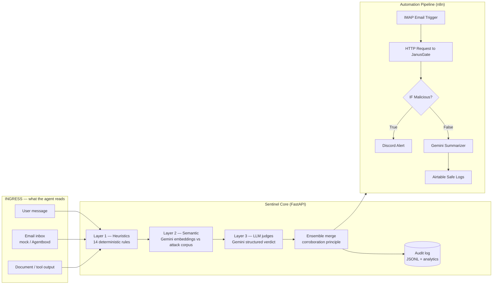

# JanusGate 🏛️🛡️

> *One face watches what enters. One watches what leaves.*

**A two-way security firewall + audit trail that protects PEOPLE from AI-enabled scams, impersonation, and fraud — in the inbox you have today, and inside the AI agents that will read your mail tomorrow.**

Scams now arrive written by LLMs, impersonating brands with lookalike domains, pressuring you to pay or hand over codes. And the newest target is your AI assistant: one hidden line in an email can hijack an agent into forwarding data or authorizing payments. 

JanusGate inspects **everything an agent reads and everything it sends**, returns **evidence-backed verdicts in milliseconds**, produces a per-message **scam report** for the human recipient, records every decision in a tamper-evident audit log, and measures itself against an **external public validation set**.

> ForgeHacks 2026 submission · Track: **AI + Cybersecurity**

## 🚀 Live Demos
* **Dashboard (Streamlit):** [https://jansgate.streamlit.app/](https://jansgate.streamlit.app/)
* **Core API (Render):** [https://janusgate-api.onrender.com/docs](https://janusgate-api.onrender.com/docs)

## Why this matters

OWASP maintains a dedicated **LLM Top 10** because prompt injection (LLM01), sensitive information disclosure (LLM02), excessive agency (LLM06), and system-prompt leakage (LLM07) are current, unsolved attack classes. Every agent that reads email, browses the web, or ingests documents is exposed. Existing defenses are closed-source commercial APIs or one-shot regex filters; JanusGate is an open, layered, **self-measuring** defense you can run anywhere — including fully offline.

## Architecture & Integration Pipeline

JanusGate exposes a lightning-fast FastAPI backend designed to act as a middleware firewall for automation pipelines (like n8n, Make, or Zapier).



### Detection ensemble (degrades gracefully — runs with zero API keys)

| Layer | What | Latency |
|---|---|---|
| **1. Heuristics** | 14 rules: direct/indirect injection, jailbreaks, tool hijacking, exfiltration, phishing, non-English injection phrases | <1 ms |
| **2. Semantic** | similarity vs labeled attack corpus — Gemini embeddings online, **offline TF-IDF fallback**; uncorroborated hits need ≥0.70 similarity | ~ms offline |
| **3. LLM judges** | **Gemini** structured output (class, risk 0–10, confidence, verbatim evidence); higher-risk verdict wins (fail-closed) | ~1 s |
| **Egress** | canary tripwire, credential shapes (AWS/GitHub/Slack/Google/OpenAI keys, JWTs), verbatim system-prompt echo | <1 ms |

## Measured Results (Zero False Positives)

| Suite | n | Precision | Recall | F1 | What it proves |
|---|---|---|---|---|---|
| Dev suite | 41 | 1.00 | 1.00 | 1.00 | ⚠️ co-designed with the rules — regression guard, **not** generalization |
| Held-out | 26 | 1.00 | 1.00 | 1.00 | author-built after rules were frozen; tuning loop saw its misses |
| **External validation set** | **546** | **1.00** | **0.12** | 0.22 | **public dataset ([deepset/prompt-injections](https://huggingface.co/datasets/deepset/prompt-injections)); precision is an upper bound (disclosed per external audit)** |

The external validation set tells the honest story: **zero false positives on 343 real-world benign texts** (critical for a firewall that users must trust). 

## Run it

### 1. Start the JanusGate Security Engine
JanusGate runs in Docker or via Python environments.
```bash
git clone https://github.com/yourusername/agent-sentinel.git
cd agent-sentinel

# Create .env and add your API keys
cp .env.example .env

# Run the API and Dashboard
docker-compose up -d --build
```
*API is now running on `http://localhost:8123` and the Dashboard is live at `http://localhost:8501`.*

### 2. The n8n Workflow (End-to-End Automation)
JanusGate acts as the brain of an intelligent email triaging system. Using n8n, we build a seamless, secure pipeline:
1. **Email Trigger (IMAP):** Listens for incoming emails.
2. **JanusGate Inspection (HTTP Request):** Sends email content to `POST https://janusgate-api.onrender.com/inspect`.
3. **If Node (Verdict Routing):** Checks `{{ $json.is_attack }}`.
4. **🔴 True (Malicious):** Pushes an instant, detailed alert to a **Discord Webhook** (Risk Score, Attack Type, Top Warning).
5. **🟢 False (Safe):** Passes the email to a **Google Gemini** agent for a 1-sentence summary, then logs the metadata (Sender, Content, Summary, Date) into an **Airtable Base**.

## Repository Map

```text
agent-sentinel/
├── backend/                           FastAPI core: ingress ensemble, egress defense,
│                                      scam & impersonation reports, audit, tool guard.
├── dashboard/app.py                   Streamlit UI (7 tabs incl. egress + analytics)
├── simulator/                         dev attack suite + scripted demo scenario
├── evals/                             held-out set, external validation set, verification
├── tests/                             pytest suite (35 tests)
├── Dockerfile, docker-compose.yml     containerized deployment (API + dashboard)
└── .github/workflows/ci.yml           CI: tests + evals on every push
```

## Team & Acknowledgments

Built for [ForgeHacks 2026](https://forgehacks.dev) — a student-run hackathon on AI for Real World Problems. Sponsor integrations: **Agentboxd** (agent email inboxes), **Featherless** (secondary open-model judge). Judge: Gemini (Google AI Studio; default judge model gemini-3.8-flash).

## License

MIT
