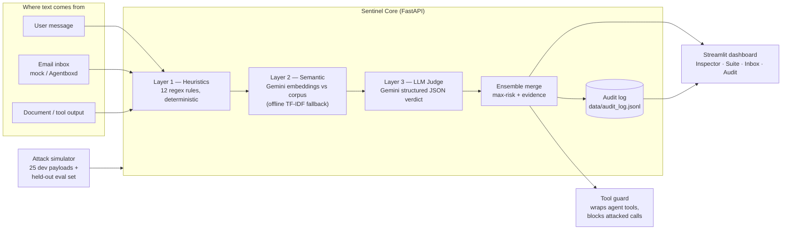

# AgentSentinel — Complete Project Blueprint

**The one document that contains everything.** A new agent (or human) reading ONLY this file,
`docs/constraints.md`, and `AGENTS.md` can continue, finish, or extend this project exactly as
intended. Last updated: Oct 3, 2026 (Day 1 of the hackathon, full build completed same day).

---

## 1. What this is

**AgentSentinel** is a security firewall and audit trail for AI agents. Modern AI agents read
emails, documents, web pages, and tool outputs — text written by *other people*. That text becomes
part of the agent's instructions ("context"). Attackers exploit this with **prompt injection**
(hidden instructions inside an email or document), **jailbreaks**, **tool hijacking** (making the
agent call tools on the attacker's behalf), **secret exfiltration**, and **phishing** delivered
directly into the agent's context window.

AgentSentinel sits between the world and the agent. Every piece of text the agent is about to
read passes through a detection ensemble that returns an **evidence-backed verdict** (attack?
which class? risk 0–10? what exact quotes drove the decision?) — and every verdict is written to
a tamper-evident-style audit log. A built-in attack simulator proves detection quality with live
precision/recall/F1 numbers.

## 2. The event this is built for (facts, verified Oct 3, 2026)

- **ForgeHacks Online 2026** — student-only, fully online hackathon. Devpost:
  https://forgehacks-2026.devpost.com · Site: https://www.forgehacks.dev
- Theme: **AI for Real World Problems**. Six tracks; we compete in **AI + Cybersecurity**.
- Track prompts were scheduled to drop Day 1 (Oct 3) on the site/Discord; as of the last check
  they were still marked locked — **the owner must grab the prompt from Discord/kickoff and map
  it per §8**.
- Timeline: build Oct 3 → **submissions lock Oct 10, 12:00 PM EDT** → judging/public vote
  Oct 10–11 → winners Oct 12, 3:00 PM.
- Teams: 1–4 students. Submission: title+description, track, **public 2–4 min video**, GitHub
  repo + README, written description (problem/users/tech/impact), screenshots/architecture/
  deploy link. Missing video or code = ineligible.
- Judging: Real-World Impact & Relevance · Technical Implementation & AI Use ("not just a
  wrapper") · Innovation & Creativity · Execution & Completeness · Presentation & Communication.
- Notable sponsors (credits for all participants): Featherless (open-model inference, $25),
  Momen, n8n (first 300), **Agentboxd** (email inboxes for AI agents + inbound prompt-injection/
  phishing checks; 30-day Builder for first 800; also the track-prize sponsor), ProjectAAL,
  Kariaa, YouCam, Adaption, Tin.computer, DevSwarm.

## 3. Why this project (decision record)

1. **Track economics:** Cybersecurity has by far the largest track prize (~$470 value: $100 cash
   + 6-month Agentboxd Team plan) vs ~$10 for other tracks — and top-3 overall projects are
   excluded from track prizes, so track odds and overall odds are separate shots.
2. **Field crowding:** student hackathons skew heavily to healthcare/education chatbots;
   a sharp security tool stands out to both track judges and the overall panel (which includes
   a Microsoft AI Identity Governance PM and multiple senior security-adjacent engineers).
3. **"Not just a wrapper" is Winnable here:** security detection produces *measurable* AI
   substance — precision/recall/F1 on a labeled suite — which a chatbot cannot demonstrate.
4. **Sponsor synergy:** Agentboxd's whole product is agent email security; building a defense/
   audit layer that can consume agent inboxes is a natural, visible sponsor integration
   (not a bolt-on).
5. **Real-world truth:** OWASP maintains an LLM Top 10 specifically because these attacks are
   current and unsolved. The problem is genuine, not invented for a hackathon.

Alternatives considered and rejected (tree-of-thoughts prune): generic AI tutor (saturated),
medical symptom chatbot (saturated + liability optics), consumer "is this a scam" paste-checker
(too shallow, single component), rooftop-solar CV estimator (data-pipeline risk in 7 days).

## 4. Architecture

**Data flow of one inspection** (`POST /inspect {text, source}`):
1. Heuristics scan → list of rule hits (rule id, category, severity, matched snippet).
2. Semantic layer → similarity vs the labeled attack corpus; if ≥ threshold, a hit with the
   matched payload's category and similarity as severity basis.
3. LLM judge (only if `GEMINI_API_KEY` present) → structured verdict: is_attack, attack_class,
   risk 0–10, confidence, verbatim evidence, reasoning.
4. Ensemble merge: any layer saying "attack ≥ threshold" wins (fail-closed on the strongest
   signal, max risk across layers, class from the highest-risk layer). Layers actually used are
   reported in the response.
5. Audit append (JSONL): timestamp, source, preview, verdict, hits, llm verdict.
6. Response: `EnsembleVerdict` (see `backend/schemas.py`).

## 5. Component map (file → responsibility → acceptance test)

| File | Responsibility | Acceptance |
|------|----------------|-----------|
| `backend/config.py` | Env/.env loading; all keys; thresholds | No import-time key requirement |
| `backend/schemas.py` | Every Pydantic shape (single source of truth) | Used by API, engine, dashboard |
| `backend/engine/heuristics.py` | Layer 1: 12 rules across 5 attack categories | Dev suite 100% (disclosed as co-designed) |
| `backend/engine/corpus.py` | Dev corpus: 19 attack + 6 benign labeled payloads | Count assert in tests |
| `backend/engine/semantic.py` | Layer 2: embeddings (Gemini) with cached vectors; offline TF-IDF cosine fallback | Improves recall on eval set vs heuristics-only; no crash without key |
| `backend/engine/judge.py` | Layer 3: Gemini structured-output judge | Returns `None` cleanly with no key / API error |
| `backend/sentinel_core.py` | Ensemble merge + risk/class decision | Verdict always well-formed |
| `backend/audit.py` | JSONL audit log + query | `/audit` returns last N entries |
| `backend/guard.py` | `SentinelGuard`: wrap tools / agent steps; `ToolBlocked` exception | Blocked demo scenario passes |
| `backend/surfaces/email_inbox.py` | Inbox abstraction: mock provider (preset benign+attack mail) and Agentboxd adapter (used when `AGENTBOXD_API_KEY` set) | `/email/inbox` returns messages + verdicts |
| `backend/main.py` | FastAPI: `/health` `/inspect` `/simulate` `/audit` `/email/inbox` `/demo/scenario` | TestClient tests green |
| `simulator/suite.py` | Dev-suite runner + metrics | precision/recall/F1 printed |
| `simulator/scenarios.py` | Scripted story demo: assistant + inbox, one injected mail gets blocked | `/demo/scenario` returns step-by-step result |
| `evals/payloads_eval.py` | **Held-out** eval set (never tuned against) | Separate file from dev corpus |
| `evals/run_eval.py` | Per-layer eval → `evals/report.md` | Report regenerable |
| `evals/verify_system.py` | Chain-of-verification: boots API, exercises endpoints, checks secrets/git hygiene | All checks green |
| `dashboard/app.py` | Streamlit UI, 5 tabs, dark theme | Headless run returns 200 |
| `tests/test_api.py` | Endpoint tests | pytest green |
| `Dockerfile` + `docs/deployment.md` | Deployment | docker build instructions documented |
| `docs/devpost.md` | Submission copy | Fields match Devpost form |
| `docs/demo-script.md` | 3.5-min video script with voiceover | Timeline ≤ 4 min |

## 6. Detection taxonomy (attack classes)

`direct_injection, indirect_injection, jailbreak, tool_hijack, exfiltration, phishing, benign` —
definitions live in the judge system prompt (`backend/engine/judge.py`) and rule table
(`backend/engine/heuristics.py`). The class vocabulary is shared by every layer and the UI.

Calibration rule (stated in the judge prompt): business text that merely *mentions* passwords or
links is benign; the suite contains such traps (e.g., "write a blog post about strong passwords",
"we share bit.ly links in our newsletter").

## 7. Original 7-day roadmap (executed in 1 day — status)

| Day | Planned | Status |
|-----|---------|--------|
| 1 | Prompt watch, scaffold, venv, heuristics, judge, simulator, dashboard skeleton | ✅ done Oct 3 |
| 2 | Semantic layer (embeddings + offline fallback) | ✅ done Oct 3 |
| 3 | Tool guard, email surface, audit log | ✅ done Oct 3 |
| 4 | Held-out eval set + per-layer metrics harness | ✅ done Oct 3 |
| 5 | Dashboard polish, scripted demo scenario, deployment kit | ✅ done Oct 3 |
| 6 | README/Mermaid, Devpost copy, video script | ✅ done Oct 3 |
| 7 | Buffer + final verification + submit | ⏳ human steps remain: record video, push to GitHub, deploy (optional), Devpost submit |

**Owner's remaining human checklist** (agents must not attempt these):
1. Get the Cybersecurity track prompt from Discord/kickoff → apply §8 → tweak Devpost copy.
2. Put `GEMINI_API_KEY` in `.env` (activates LLM-judge layer) — rerun `evals/run_eval`.
3. Optionally redeem Featherless/Agentboxd credits (Discord) → optional keys in `.env`.
4. `git init` is done locally; create the GitHub repo, push.
5. Optional deploy per `docs/deployment.md` (Render/HF Spaces/Docker).
6. Record the 2–4 min video per `docs/demo-script.md`, upload publicly.
7. Submit on Devpost from `docs/devpost.md` before **Oct 10, 10:00 AM EDT** (2h buffer).

## 8. Track-prompt adaptation plan (when the prompt drops)

The chassis is deliberately prompt-agnostic. Mapping rules:

- If the prompt is about **phishing/email security** → lead with the Inbox tab + email surface
  in the video; retitle Devpost emphasis to "phishing defense for agent inboxes".
- If it's about **prompt injection / agent safety** → lead with Inspector + tool guard; the
  default framing already matches.
- If it's about **SCADA/IoT/network/classic security** → position AgentSentinel as the AI layer:
  human-facing security copilot framing; the simulator stays the differentiator.
- Whatever it says: add an explicit "How we answer the prompt" section at the TOP of the Devpost
  description quoting the prompt verbatim. This is criterion #1 for judges.

## 9. Metrics methodology (the honesty section)

- **Dev corpus** (`backend/engine/corpus.py`): co-designed with the rules. Perfect scores on it
  are expected and must always be labeled "co-designed dev suite".
- **Held-out eval** (`evals/payloads_eval.py`): written as a *separate* exercise from rule
  tuning; rules/thresholds are tuned only on dev. Author-constructed (disclosed); integrating
  public benchmarks (e.g., OWASP/academic injection corpora) is listed as future work.
- Every published metric must be regenerated by `evals/run_eval.py` at submission time.
- LLM-judge numbers require `GEMINI_API_KEY`; without it, reports say "heuristics+semantic only".

## 10. Risk register

| Risk | Mitigation |
|------|-----------|
| Track prompt conflicts with project | §8 adaptation plan; chassis covers phishing↔injection↔agent-safety span |
| Gemini free-tier rate limits during demo | Ensemble degrades gracefully; offline TF-IDF fallback; heuristics always run |
| Judge latency during live demo | Pre-run the suite before recording; show cached results + one live scan |
| Metrics look "too perfect" to judges | §9 disclosure next to every number; held-out eval included |
| Windows/path issues for reviewers | pathlib everywhere; Dockerfile for Linux runs; README quickstart |
| .env leakage | gitignored from first commit; `verify_system` checks `git ls-files` |

## 11. Glossary

- **Prompt injection** — instructions smuggled into text an agent reads, hijacking its behavior.
  *Direct*: from the user. *Indirect*: hidden in email/docs/web content the agent processes.
- **Jailbreak** — attempts to remove safety behavior (DAN, "developer mode").
- **Tool hijack** — driving the agent to invoke tools/actions for the attacker.
- **Exfiltration** — stealing secrets, system prompts, or conversation history.
- **LLM-judge** — an LLM classifying text with a constrained JSON schema (structured output).
- **Ensemble** — multiple detectors merged; here: any strong signal wins (fail-closed).

## 12. Verification protocol (what "done" means)

`evals/verify_system.py` must print all-green: syntax compile of every module, TestClient pass
over all six endpoints, dev-suite metrics computed, eval report exists and is fresh, dashboard
imports + serves 200 headless, no secret values in tracked files, `.env` not tracked by git.
Any red line = not done. Numbers reported to the user must come from that run, not memory.
